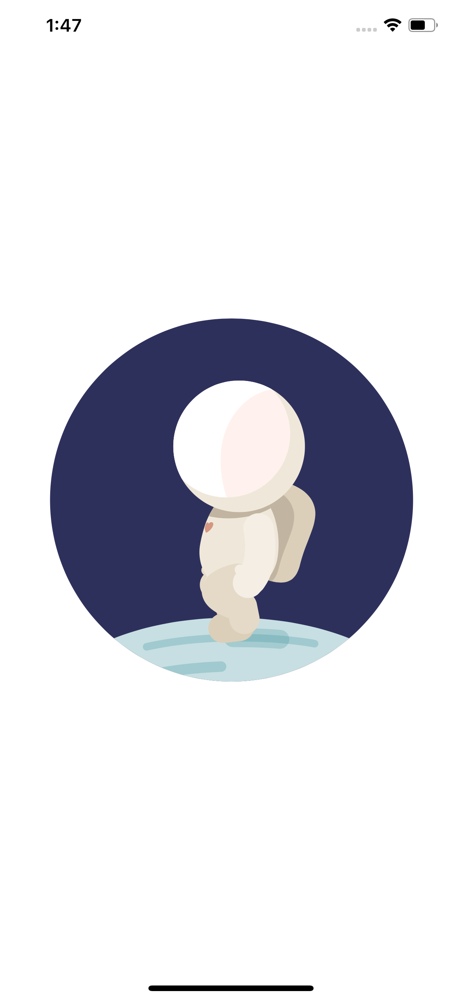

## MoonWalker-Animation

Practica de animacion para incluir animaciones realizadas con After Effect, que son de menor tamaño y mejor calidad.

<h1 style="font-size: 40px;">🎬 MoonWalker-Animation</h1>

MoonWalker-Animation is a simple practice project built with Swift an the framework LOTTIE to explore the behavior and integration of animations. This project demonstrates how to implement basic animations and transitions in SwiftUI. The goal is to understand the interactions of different animation types and how they can be applied to a potential project. No architecture or refactoring is considered in this project, as it's just a simple experiment.

<h1 style="font-size: 40px;">📸 Screenshots</h1>

  

<h2 style="font-size: 35px;">🚀 Features</h2>

✅ Basic Lottie animations   

<h2 style="font-size: 35px;">🏗 Architecture</h2>

This project follows a straightforward Swift-based approach without a specific architecture. The main focus is on exploring animations, using a minimal setup to demonstrate different types of animations and transitions.

<h2 style="font-size: 35px;">🔧 Technologies & Tools</h2>

Swift 5  
Xcode 16  
iOS 18  
Swift

<h2 style="font-size: 35px;">📋 Requirements</h2>

iOS 15 or later  
Xcode 13

<h2 style="font-size: 35px;">📦 Installation</h2>

Clone this repository:

git clone https://github.com/eduardojordan/MoonWalker-Animation.git

Open the project in Xcode 16

Run the app on a simulator or real device

<h2 style="font-size: 35px;">🔑 API Configuration</h2>

No API required for this project, it focuses solely on local animations.

<h2 style="font-size: 35px;">#📜 Usage</h2>

Open the app and interact with the various animation triggers (e.g., tap buttons to see animations)
Explore the transitions and see how different animations work within SwiftUI

<h2 style="font-size: 35px;">🔮 Future Enhancements</h2>

✅ Add more complex animation types (e.g., spring, keyframes)  
✅ Integrate animations with state management  
✅ Create interactive animation elements  
✅ Experiment with custom animation curves  
✅ Refactor the code for a more structured approach

<h2 style="font-size: 35px;">🤝 Contribution</h2>

If you’d like to contribute, feel free to fork the project and submit a pull request with your improvements. All contributions are welcome!

<h2 style="font-size: 35px;">🙌 Acknowledgments</h2>

🎨 Swift for enabling beautiful animations and transitions with Lottie
💡 Apple Developer Documentation for SwiftUI insights and tips

<h2 style="font-size: 35px;">📄 License</h2>
